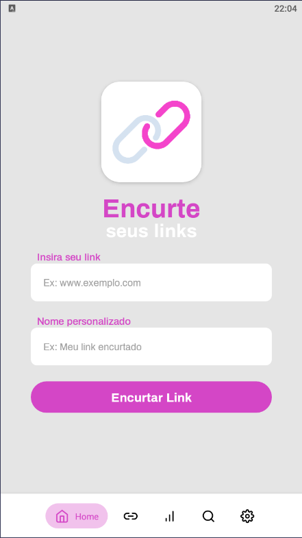
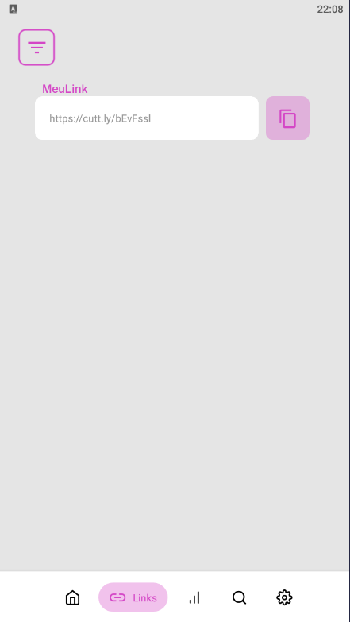
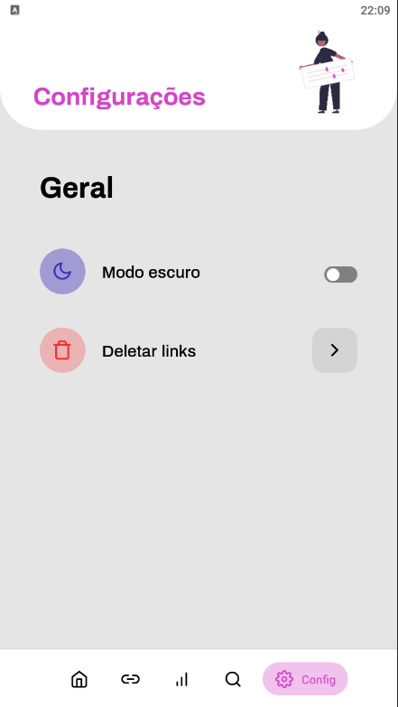

<p align="center">
    
    <p align="center">Aplicativo para encurtar links, desenvolvido em React Native com Expo ⚛️🚀</p>
</p>

<h1 align="center">📌Tabela de conteúdos<h2>
<p align="center">
    <a href="#computer-projeto">• Projeto</a>
    <a href="#camera-demonstração">• Demonstração</a>
    <a href="#link-pré-requisitos">• Pré-Requisitos</a>
    <a href="#technologist-instalação">• Instalação</a>
</p>


<h4 align="center"> 
	✅  Encurtador de Links 🚀 Finalizado  ✅
</h4>

## :computer: **Projeto**
O Encurtador de Links é uma aplicação mobile desenvolvida em React Native e Expo utilizando a API do <a href="https://cutt.ly/api-documentation/cuttly-links-api">Cuttly</a>, para encurtar links e salva-los, além disso, é possível editar, excluir e compartilhar links encurtados através do app.

## :camera: **Demonstração**
<p align="center">
    
    
    
    
    
    
</p>

## :link: **Pré-Requisitos**
Antes de começar, é necessário ter o <a href="https://reactnative.dev/docs/environment-setup">React Native</a> e <a href="https://docs.expo.dev/get-started/installation/">Expo</a>, além disso, é interessante ter um bom editor de código para trabalhar, como o <a href="https://code.visualstudio.com/Download">VSCODE</a>.

## :technologist: **Instalação**
1. Clonar repositório
2. Abrir o VSCODE com o repositório
3. Abrir o terminal do VSCODE ou abrir o cmd dentro do repositório
4. Execute os comandos abaixo
```sh
yarn
```
```sh
expo start
```
5. Abra o servidor local(localhost) exibido no terminal

No celular: 
1. Instale o Expo Go em seu celular
2. No servidor local, escaneie o QR CODE, com o Expo go e pronto

No emulador:
1. Clique em "Run on Android device/emulator", caso seja android, se não, clique em "Run in iOS simulator"

Todos os tipos de contribuições são muito bem-vindos e apreciados!
- ⭐️ Favoritar o projeto!
- 🐛 Encontrar e relatar problemas!

Feito por DiegoSousa-11 👋 <a href="https://www.linkedin.com/in/diego-sousa-28003b209/">Entre em contato!</a>
